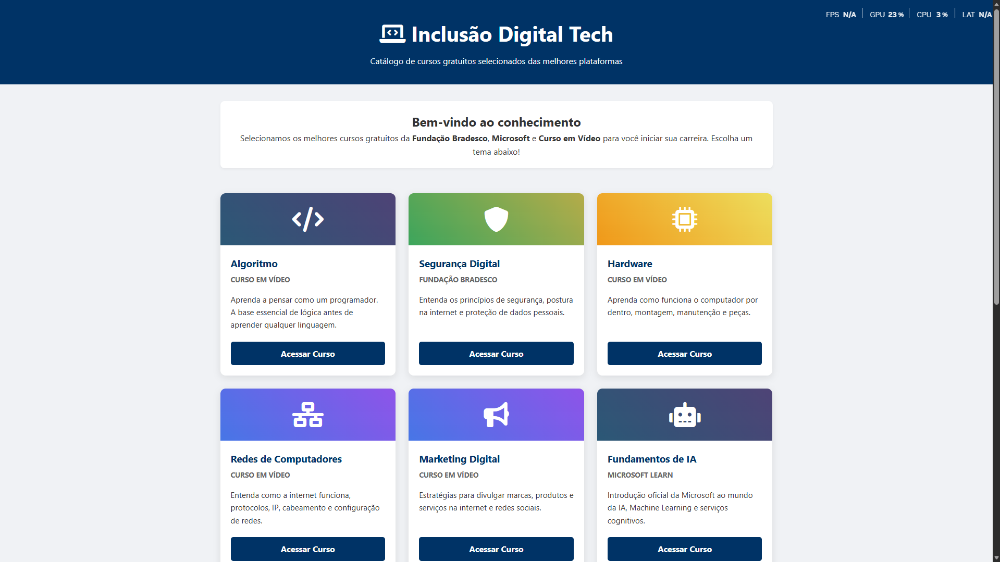
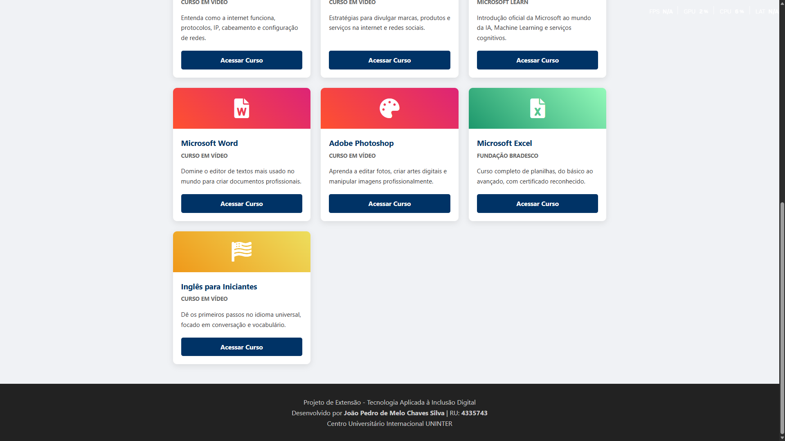

# 💻 Catálogo de Cursos Gratuitos de Tecnologia

> Projeto de Extensão Universitária - Inclusão Digital Tech


---

## 🔗 Demonstração Online
Acesse o projeto funcionando clicando no link abaixo:
### [🌐 CLIQUE AQUI PARA ACESSAR O SITE](https://joao2133.github.io/extensionista2-gestao/)

---

## 📖 Sobre o Projeto
Este projeto foi desenvolvido como parte da disciplina de **Atividade Extensionista II** do curso de **Gestão da Tecnologia da Informação** do Centro Universitário Internacional **UNINTER**.

### 🎯 Objetivo
O objetivo principal é promover a **inclusão digital** e democratizar o acesso ao ensino de tecnologia. O site atua como um hub centralizador (catálogo), reunindo os melhores cursos gratuitos de plataformas renomadas, facilitando a busca para jovens e adultos que desejam ingressar no mercado de TI sem custos.

### 📚 Conteúdo Agregado
O catálogo seleciona e organiza cursos das seguintes plataformas:
*   **Fundação Bradesco** (Excel e Segurança Digital)
*   **Microsoft Learn** (Inteligência Artificial)
*   **Curso em Vídeo** (Algoritmos, Hardware, Python, etc.)

---

## 🛠️ Tecnologias Utilizadas

O projeto foi construído focando em desempenho e acessibilidade, utilizando tecnologias web padrão:

*   **HTML5 Semântico:** Para estruturação correta do conteúdo e SEO.
*   **CSS3 Moderno:**
    *   **CSS Grid:** Para o layout responsivo dos cards.
    *   **Flexbox:** Para alinhamentos internos.
    *   **Media Queries:** Para garantir que o site funcione em celulares e tablets.
*   **Font Awesome:** Para ícones visuais intuitivos.
*   **Git & GitHub Pages:** Para versionamento e hospedagem gratuita.

---

## 📸 Screenshots (Evidências)

| Tela 1 | Tela 2 |
|:---:|:---:|
|  |  |

> *Nota: O layout é totalmente responsivo e se adapta a qualquer tamanho de tela.*

---

## 🚀 Como executar localmente

Caso queira rodar o projeto na sua máquina:

1. Clone o repositório:
   ```bash
   git clone https://github.com/joao2133/extensionista2-gestao.git